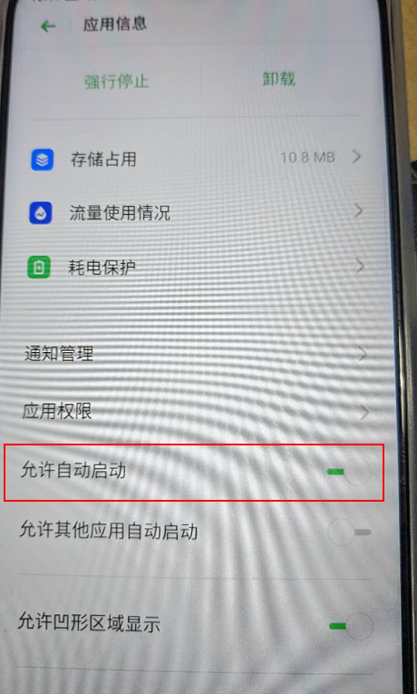

# 组件设计说明

​		插件并不是以项目需求--特定设备上报GPS做的全功能设计.是按照通用手机后端调度的方式进行的设计.在满足本次高速项目需求的前提下做到:

* 适配 andorid4.4. ~ android 10 大多数ROM
* 服务具备守护进程.被杀死可以拉起
* 国产ROM在用户主动给予系统启动权限后可以再设备重启后自动启动上报服务
* 支持Task模式.在核心功能编写完以后,将高速的需求作为一个Task来实现.


# 组件设计约定

​	组件以Service的方式独立存在 ,与具体的应用关系不大, 具体的应用只负责首次启动,完成服务第一次启动以及注册重启广播的注册.

​    组件产生的临时文件,按照Android10的设计规范只在**应用私有目录中产生,当用户卸载应用后私有文件也会随之删除**,避免在用户手机sdcard空间拉屎.同时也请注意该组件产生的文件的使用场景.因为会随用户的删除应用动作而删除.

​    **组件与具体应用的通讯只有一个extendData(扩展信息文件)**,应用需要通过写入需要组件获取或提交的内容到扩展文件中,组件才能转交给Task进行业务逻辑操作. 比如: 具体应用将当前登录用户信息写到扩展信息中,组件中的Task才能获取到用户信息再将信息做为心跳发送给服务器.

​	组件会根据设备产生一个设备指纹,指纹由 deviceId + imei + 品牌+ 型号+.....(手机基本信息属性) 合成的32位唯一指纹. **这个指纹只能在用户不更换手机卡,不刷机的情况下才能保证同一设备唯一**

​	**所有保存的临时文件会根据设备指纹做秘钥进行加密保存.如果中途换卡/刷机都会导致以前保存的文件无法解密**.	

​	

# 组件保活与调用周期

## 保活手段

* Android 7.1 之前通过 service 仿冒的方式(前台服务)
* Android 7.1 之后通过 JobScheduler service做守护进程 来实现辅助保活(10-15分钟随机检查一次.死掉拉起)
* 监听 时间变化(1分钟接收一次) 电量变化. 开屏关屏. usb接入 . 应用安装. 等通知. 收到通知的同时检查是不是被杀死. 杀死拉起


## 调用周期

​	为了避免"过分频繁"导致用户不可能接受. 组件GPS获取周期为 5 分钟. 所有Task触发周期为5分钟一次.

​    已在oppo A8实测 运行8小时耗电 21毫安


# 组件API

## 获取设备指纹

```javascript
 ETCLocation.getDeviceId(function(deviceId){
            alert(deviceId);
 },function(err){});
```


## 保存扩展信息

```javascript
  ETCLocation.saveExtendData(function(success){ },function(err){},{
            a:123,
            userName:'李四',
  });
 // saveExtendData (成功回调, 失败回调, [要保存的信息])
```


## 删除扩展信息

```javascript
 ETCLocation.deleteExtendData(function(success){},function(err){});
```


## 启动后台调度服务

```javascript
 ETCLocation.startBackgroundLocation(function(success){
        alert(success)
        },function(err){
            alert(err)
        },{
            extendParams:'{"a":"aaaaa"}'
        })
```


## 离线数据相关功能API

### 获取TaskType目录下未上传文件个数

```javascript
 ETCLocation.getFileListByTaskType(function(filePathList){
            alert('文件列表个数: '+filePathList.length);
     
     // 循环filePathList 可以获取每个文件具体路径
  },function(err){
  },{
            taskType:'check'
  });
```


### 读取离线文件内容

```javascript
 //读取离线文件内容
            ETCLocation.readOffLineData(function(content){
                alert('读取内容: '+content);
            },function(err){
            },{
                filePath:mfilePath  // 路径
            });

```

### 获取TaskType根目录路径

```javascript
 ETCLocation.getSavePathByTaskType(function(rootPath){
                    alert('rootPath: '+rootPath);
     //'/storage/emulated/0/Android/data/com.talkweb.tollmanage/files/copy.txt'==>
     // /storage/emulated/0/Android/data/com.talkweb.tollmanage/files/aaa
             },function(err){
             },{
                taskType:'check',
             });
//通常结合copyFile 函数使用
```

### 复制文件

```javascript
 //复制文件
            ETCLocation.copyFile(function(isCopyComplate){
                alert('文件是否复制成功: '+isCopyComplate);
            },function(err){
            },{
                fromFilePath:mfilePath,
 toFilePath:'/storage/emulated/0/Android/data/com.talkweb.tollmanage/files/copy.txt'
            });
```

### 保存离线文件

```javascript
  ETCLocation.saveOffLineData(function(mfilePath){
            alert(mfilePath); //返回保存后的文件Path
        },function(err){
        },{
            taskType:'check',
            content:JSON.stringify({a:123,b:123})
        });

```


### 删除文件

```javascript
  ETCLocation.deleteFile(function(){
        },function(err){
        },{
            filePath:'文件路径',
        });
```


# 高速上报Task提交信息

​		针对高速项目的需求,拟定提交如下信息.主要 [是否必填]字段. 这种情况 主要是发生在设备获取不到信息或者用户未登录/注销后获取不到的情况.**如果还有补充需求 可以提出进行补充**

| 字段名      | 含义              | 是否必有 | 示范值                           | 补充说明                                                     |
| ----------- | ----------------- | -------- | -------------------------------- | ------------------------------------------------------------ |
| latitude    | 维度              | 必有     | 28.218723                        |                                                              |
| longitude   | 经度              | 必有     | 112.891986                       |                                                              |
| radius      | 半径范围          | 必有     | 40                               |                                                              |
| GPSTime     | GPS刷新时间戳     | 必有     | 2020/3/12  15:18                 | 当设备长时间静置,可能多次上报的GPS产生时间是同一个.          |
| deviceId    | 设备Id(指纹)      | 必有     | C7B4C3E59BF03D874ABE2D2ECA164E63 | 使用DeviceID+Imei+品牌+型号+终端信息  组合算出的指纹,当用户 换卡.刷机会变更该ID |
| deviceModel | 品牌与型号        | 非必有   | OPPO PDBM00                      |                                                              |
| OS          | 操作系统          | 非必有   | Android9                         |                                                              |
| userId      | 登录用户id        | 非必有   | 登录以后的用户id                 |                                                              |
| versionName | app客户端当前版本 | 必有     | APP当前版本号                    | 1.0.0                                                        |
| versionCode | app客户端当前版本Code | 必有     | APP当前版本code                    | 10000                                                     |
| userName    | 用户名            | 非必有   | 登录以后的用户名                 |                                                              |
| createTime  | 记录产生时间      | 必有     | 2020/3/12  15:18                 | 手机端产生时间                                               |


# 关于开机自启动说明

在非root机型上,需要用户在应用设置里面开启允许自启动,比如OPPO A8需要用户手动 开启允许应用自启动



只要用户自动设置 允许 自动启动. 已经测试过 小米/华为等 从Anroid 4.4. ~ Android 10均可以实现开机后自动上报.
所以非ROOT设备的情况下.只要在制度上保证用户开启该选项即可

